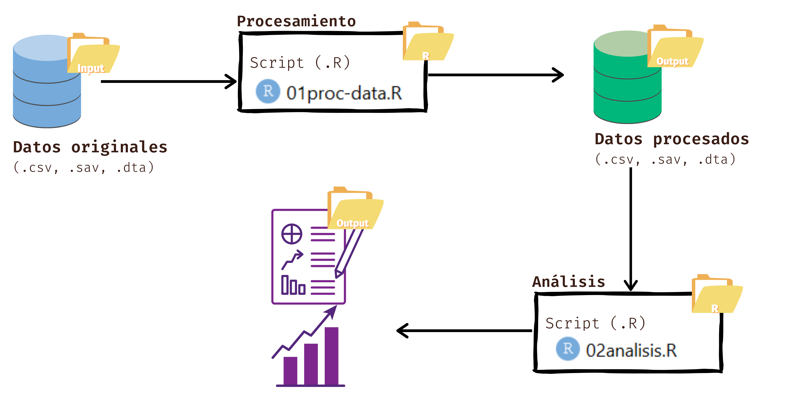

## I. Cargar paquete
Necesario para poder procesar los datos.

```{r instalar_paquetes, include=FALSE}

installed.packages("tidyverse")

#El paquete de tidyverse funciona para manipular y visualizar los datos.
```


## II. Flujo.

```{r imagen_flujo, echo=FALSE}



```


Carpetas:
a.- Input: Aquí van datos (.csv, .sav, .dta) y documentos (.doc, .pdf).
b.- Output:Codigos de procesamiento y análisis (.R) y documentos reproducibles (.Rmd). Aquí van los datos procesados.
c.- R: Luego aquí van los datos procesados (.csv, .sav, .dta) y las tablas y figuras que se generen (.png, .xlsx).

.Rproj tiene como función principal administrar la configuración y el entorno de trabajo de un proyecto en R. Básicamente genera un ambiente para el proyecto.


## III. Descriptivos.

Música y género.

Una problemática relevante en la música y especificamente en la chilena, es la inequidad de género que enfrentan las mujeres en este arte. Estudios han identificado diversas barreras y brechas que aumentan la invisibilidad femenina en el ambito musical. Dentro de barreras y brechas nos centraremos en comparar la cantidad de hombres y mujeres que se dedican, los géneros musicales en los que predominan y qué tan representados se sienten dentro de la industria.

De acuerdo a Alvarado que trabajó sobre la base de un estudio cuantitativo donde se realizaron encuestas a 75 personas de la escena, nos encontramos con estos resultados.

1. Tabla

Pregunta: ¿Qué tipo de estilo musical tocas en tu proyecto? (grupo 1).

-----------------------------------------------------------------------
|                 Femenino       Masculino      No binario      Total |
|Pop                 5               3              3             11  |
|Rock                3              18              1             22  |
|Indie               3              20              6             29  |
|Jazz                1               4                             5  |
|Folclor             1               1              1              3  |
|Electrónica         1                              1              2  |
|Variados                            1                             1  | 
|Urbano                              1                             1  |
|Ska                                 1                             1  |
|Total              14              49             12             75  |
-----------------------------------------------------------------------

Fuente: Fraile Alvarado, S. (2022).Carrera musical, género y economía Oportunidades para ser música en Chile.


En la tabla se puede identificar cuantos hombres y mujeres se dedican a la música, siendo estas últimas quienes no llegan ni al 30% de la muestra, osea que las mujeres se dedican en menor medida a este campo. Además, se expone una gran brecha respecto a los géneros, siendo el pop el único género en el que las mujeres sobresalen entre 9 distintos géneros. La industria musical chilena parece estar marcada por una segmentación de género en los estilos musicales.


2. Gráfico
```{r gráfico_representación, echo=FALSE}


```

Fuente: Fraile Alvarado, S. (2022).Carrera musical, género y economía Oportunidades para ser música en Chile.

En el gráfico se identifica en general, una percepción de representación es baja en la industria musical para todas las identidades de género. Pero específicamente los hombres parecen sentirse más representados en comparación con mujeres y personas no binarias, ya que son los únicos que aparecen en la opción 4. Las personas femeninas y no binarias reportan una representación particularmente baja, con pocos casos en los niveles altos.

Esto evidencia la desigualdad en la industria musical chilena en términos de visibilidad y representación de diferentes géneros.

3. Conclusión.

La tabla y el gráfico en conjunto refuerzan la idea de que la música en Chile no es un espacio equitativo en términos de género. No solo hay una baja percepción de representación, sino que también se observa una brecha en ciertos géneros musicales.


Bibliografía

Fraile Alvarado, S. (2022).Carrera musical, género y economía Oportunidades para ser música en Chile. Disponible en https://repositorio.uchile.cl/handle/2250/197586


